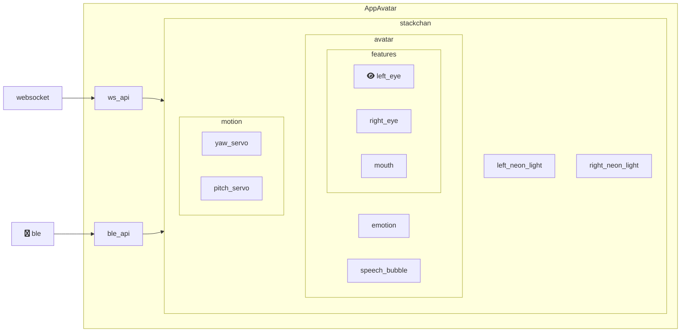

# StackChan Firmware

## Build

### Fetch Dependencies

```bash
python3 ./fetch_repos.py
```

[fetch_repos.py](./fetch_repos.py) downloads dependencies with reading [repos.json](./repos.json). This json file contains a list of git URL, local folder path, and branch name/commit ID. The local path is `components/{dependency name}`.

### Tool Chains

Official Build tool is [ESP-IDF v5.5.1](https://docs.espressif.com/projects/esp-idf/en/v5.5.1/esp32s3/index.html). You need install it with reading the GUIDE.

### Build

```bash
idf.py build
```

### Flash

```bash
idf.py flash
```

## Firmware Overview

*M5Stackchan Firmware* uses [mooncake](https://github.com/Forairaaaaa/mooncake) as main framework. mooncake can manage and scheduling multiple Apps.

[main.cpp](./main/main.cpp) installs and run the following Apps.

- AppLauncher
- AppAiAgent
- AppAvatar
- AppEspnowControl
- AppSetup

### AppAvatar

*AppAvatar* controls the face and head motion.



Skin is subclass of `stackchan::avatar::Avatar` such as `DefaultAvatar` in [default.h](./main/stackchan/avatar/skins/default/default.h).

`Emotion` is enum defined in [emotion.h](./main/stackchan/avatar/avatar/elements/emotion.h).

<!-- `GetHAL()` is what??? Hardware Abstraction Layer? -->